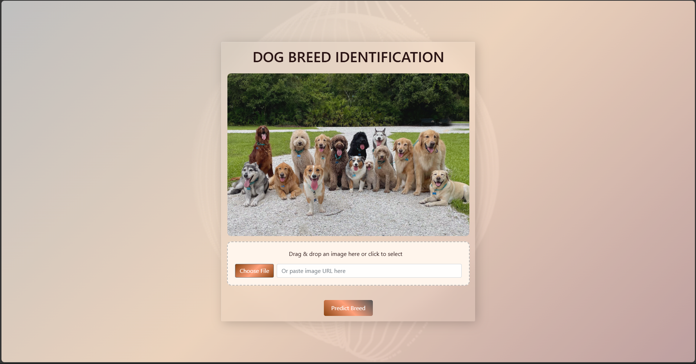
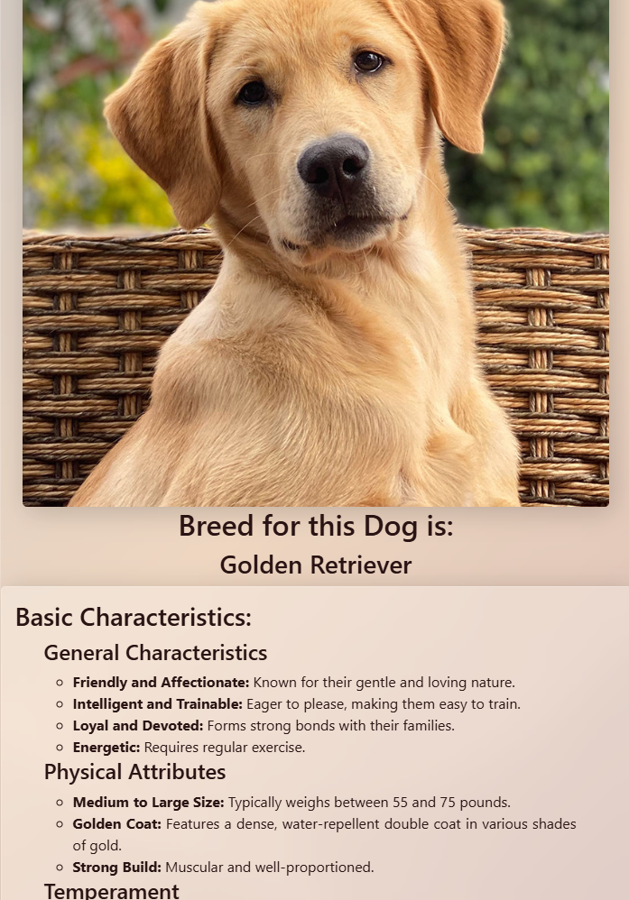

# Breed-Identifier-2.0

This repository contains the source code for a Flask web application that identifies the breed of a dog from an uploaded image using a pre-trained deep learning model. Additionally, the application provides information about the predicted breed, including characteristics and basic needs, retrieved from the Google Gemini Flash 2.0 model.

## Link to Dataset & Pre-trained Model
- [Google Drive - Dog Breed Identification](https://drive.google.com/drive/folders/1V8V6GcJHaloWTfusTd_c1GKxLswI4Clp?usp=sharing)

## Prerequisites
- Python 3.x
- Flask
- [Gemini API](https://ai.google.dev/gemini-api/docs)

## Setup
1. **Clone the repository:**
   ```bash
   git clone [https://github.com/KavMann/Dog-Breed-Identification.git]
   cd your-repository

2. **Install dependencies:**
   ```bash
   pip install -r requirements.txt

3. **Obtain OpenAI API Key**
    - Visit [Gemini API](https://ai.google.dev/gemini-api/docs) to sign up for an account if you don't have one.
    
    - Once logged in, navigate the dashboard to find your "Get a Gemini API Key".

4. **Insert Gemini API Key**
    - Open the `app.py` file in the project.
  
    - Locate the following line of code:
     ```python
     #Replace the placeholder API key with your actual OpenAI API key
     client = genai.Client(api_key="your-api-key-here")

## Run the Application:
  ```bash
  python app.py
  The application will be accessible at http://127.0.0.1:5000/ in your web browser.
```
## Usage
Upload an Image:
    -Visit the web page and upload an image of a dog.


## Features
- **Dog Breed Identification:** The application uses a pre-trained deep learning model to predict the breed of a dog based on an uploaded image.

- **Breed Information:** The predicted breed's characteristics are fetched from the Google Gemini Flash 2.0 language model to provide users with basic information about the breed.

- **Breed Needs:** The application also queries the Google Gemini model for information about the basic needs of the predicted dog breed, assisting users in understanding the requirements of the breed before adoption.

## Dataset
The training data is sourced from a CSV file (labels.csv) containing information about dog breeds and corresponding image file names. The dataset is preprocessed to include only a specified number of unique dog breeds.

## Model Architecture & Training

The dog breed identification model is trained using the **Xception** architecture, which is pre-trained on ImageNet. The training process involves two main phases:

### **Phase 1: Freeze Base Model**
- The base model (Xception) is loaded with pre-trained ImageNet weights.
- The base layers of the Xception model are frozen, meaning they are not updated during training. Only the custom top layers (including a dropout layer and a dense layer for classification) are trained.
- This phase helps the model learn to classify dog breeds based on the pre-learned features of Xception.

### **Phase 2: Fine-Tune the Model**
- In this phase, the top 50 layers of the Xception model are unfrozen, allowing the model to fine-tune these layers while keeping the lower layers frozen.
- A lower learning rate is used for this phase to prevent overfitting and ensure gradual learning.

### **Training Details**
- **Data Augmentation:** The model is trained using `ImageDataGenerator`, which applies transformations like rotation, width/height shifts, shear, zoom, and horizontal flip to augment the dataset and prevent overfitting.
- **Class Weights:** Class weights are computed to balance the dataset and prevent the model from being biased towards overrepresented dog breeds. This ensures that the model learns equally well for all breeds, even those with fewer images.
- **Early Stopping and Learning Rate Scheduling:** 
   - **EarlyStopping:** Stops training early if the validation loss doesn’t improve for 8 consecutive epochs, preventing overfitting.
   - **ReduceLROnPlateau:** Reduces the learning rate when the validation loss plateaus, allowing the model to converge more smoothly.

### **Saving the Model**
- After both phases of training, the model is saved as `Final_dog_identification.h5`. This file can be loaded later to make predictions without retraining the model.


## Prediction
The trained model is saved as "Final_dog_identification.h5" and can be loaded for making predictions. The provided code demonstrates how to load the model, preprocess an image, and predict the dog breed. The prediction includes checking if the confidence of the prediction is above a specified threshold.

## App Screenshot

Here’s a screenshot of the app working:




